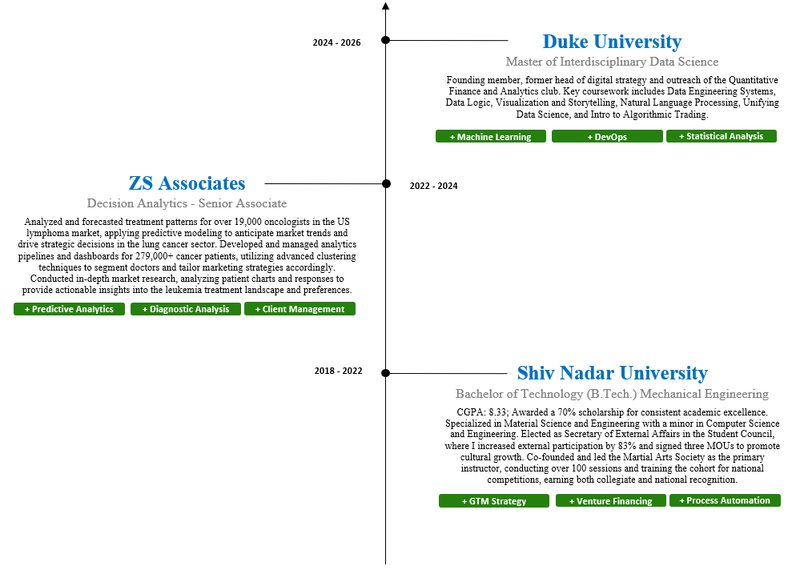

# Adil Keku Gazder (@ag826)

As a Data Science graduate student at Duke University (Class of '26), I am passionate about bringing multidisciplinary perspectives and data-driven approaches to solving today’s biggest challenges and creating impactful solutions from the ground up. My diverse experiences span various domains, including recent work in Healthcare focusing on Oncology analytics (Lung Cancer and DLBCL), following a successful stint in the Logistics industry where I specialized in Growth Strategy and Diversification. I strongly believe in the power of collaboration and love understanding how we can apply advanced computing techniques, theories, and algorithms in our everyday lives.

I completed my Bachelor's degree from Shiv Nadar University in Mechanical Engineering with a specialization in Materials Sciences (focusing on Nanostructured Functionalized Surfaces) and a minor from the Department of Computer Science and Engineering. Beyond academics and professional work, I'm also a Podcast Host, an Emcee, an Investor, a Researcher, and a two-time All-India level Double Gold Medalist in Taekwondo.

## Skills

💻 **Languages:** C, Java, Python(Pandas, NumPy, PySpark, Matplotlib), SQL, RUST, R

🛠 **Softwares:** AWS (S3, Athena, Redshift, EMR), MS Office (Excel, Powerpoint), Databricks, Tableau

🎓 **Certifications:** Advanced Data Analytics (Google), Advanced SQL (Kaggle), Intermediate Machine Learning (Kaggle)

## The Journey Here

## Impact Delivered
-	Analysed and forecasted treatment patterns for 19K+ oncologists in the US lymphoma market, applying predictive modelling techniques to forecast market trends. 
-	Drove commercial strategy decisions in the lung cancer market using comprehensive patient journey mapping; created analytics pipelines and dashboards managing 279K+ cancer patients.
-	Utilized advanced clustering techniques to segment doctors, demonstrating the ability to identify usage patterns and tailor marketing and engagement strategies for each segment.
-	Conducted comprehensive market research, analysing patient charts and responses to deliver actionable insights into the current leukaemia treatment landscape and preferences. 
-	Designed Go-to-Market (GTM) strategies for and subsequently led the Direct to Consumer (DTC) pilot project to redesign, digitize and optimize the delivery network model.
-	Provided solutions to optimize daily operations by creating dashboards analysing key performance metrics, resulting in minimized human intervention and error. Additionally optimized client brand distribution and restock strategies, resulting in minimized Return to Vendor (RTV) orders by 18%.
-	Directed a team of 3 in conducting market research for various diversification opportunities in the Retail and HoReCa markets in India and abroad.
-	Reviewed various avenues and successfully raised seed funding from a prominent sector-agnostic fund pool. Received additional non-monetary grants from Startup India and on being ranked within the Top 100Startups in Maharashtra (MSINS, 2021).
-	Elected as Secretary of External Affairs (Student Council - 2020) and facilitated an 83% increase in external participation with students representing the university on 50+ different occasions. Signed 3 MOUs with various organizations to promote cultural and technical growth within the university.
-	Co-Founded and led the Martial Arts Society as the primary instructor for 2 years, conducting 100+ sessions for 60+ students and faculty members. Hosted multiple seminars while training the cohort for national-level competitions, earning recognition and accolades from senior leadership of the university.

## Passion Areas
🌄 **Adventure:** Exploring the path not taken. River rafting, paragliding, rock climbing

🏊‍♂️ **Fitness:** Swimmer, cyclist, weightlifter and black belt martialist

📽 **Entertainment:** Formula 1, audiobooks and TV shows!

## Lets connect!
)

